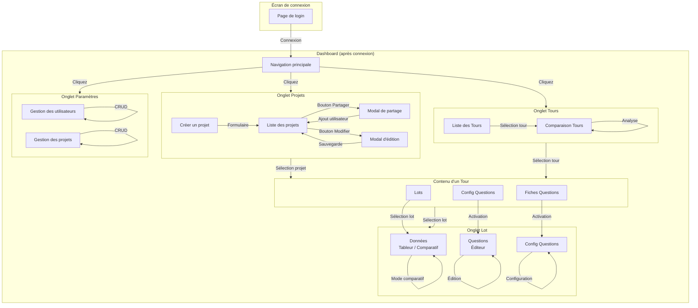
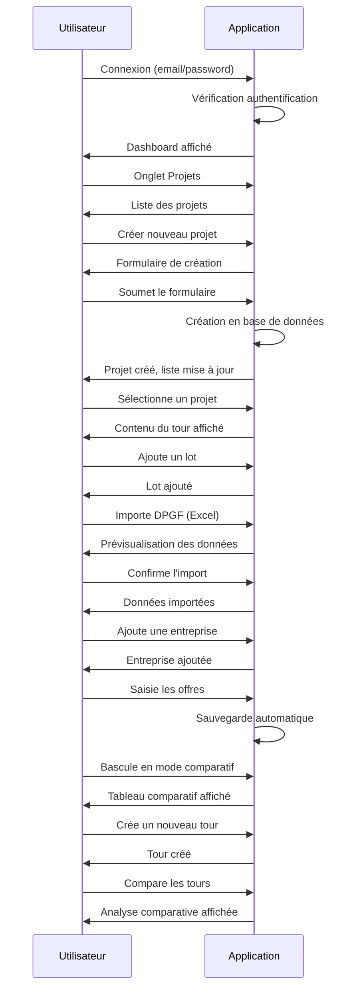

# Guide de Navigation - AO Link

## Vue d'ensemble de l'application

L'application AO Link est un comparateur d'offres pour les appels d'offres. Elle permet de gérer des projets, des tours (phases), des lots et de comparer les offres des entreprises.

---

## Diagramme de Navigation

---

## Détail des Écrans et Fonctionnalités

### 1. Écran de Connexion (`/login`)

| Élément | Description |
|---------|-------------|
| **Champs** | Email, Mot de passe |
| **Actions** | Connexion, Mot de passe oublié |
| **Rôles** | Tous les utilisateurs |

---

### 2. Dashboard - Navigation Principale

La barre de navigation principale contient 3 onglets :

| Onglet | Icône | Accès | Description |
|--------|-------|-------|-------------|
| **Projets** | 📁 | Tous | Liste et gestion des projets |
| **Tours** | 🔄 | Tous | Gestion des phases/tours |
| **Paramètres** | ⚙️ | Admin/Responsable | Administration |

---

### 3. Onglet Projets (`#tab-projects`)

#### Liste des projets
- Tableau affichant : ID, Nom, Réf, Client, Date de création
- **Actions disponibles** :
  - 👁️ **Voir** - Accéder au projet
  - 🔗 **Partager** - Ouvrir le modal de partage
  - ✏️ **Modifier** - Éditer les informations du projet
  - 🗑️ **Supprimer** - Supprimer le projet (admin/responsable)

#### Création de projet (admin/responsable uniquement)
- **Champs** : Nom *, Référence, Client, Localisation

#### Modal de Partage
- Sélection d'un visionneur
- Option "Autoriser la modification"
- Liste des partages existants avec possibilité de retrait

#### Modal d'Édition
- Modification du nom, référence, client, date
- Gestion des partages (ajout/suppression)

---

### 4. Onglet Tours (`#tab-rounds`)

#### Sous-onglets

| Sous-onglet | Description |
|-------------|-------------|
| **Liste des Tours** | Gestion des phases du projet |
| **Comparaison Tours** | Analyse comparative entre tours |

#### Liste des Tours
- **Actions** :
  - Créer un nouveau tour
  - Réordonner par glisser-déposer
  - Exporter les données
- **Carte de tour** : Nom, nombre de lots, statistiques

#### Comparaison Tours
- **Vues disponibles** :
  - 📊 **Comparatif** - Tableau comparatif des montants
  - 📦 **Sélection options** - Comparaison des options sélectionnées
  - 🧪 **Simulation** - Simulations de scénarios

---

### 5. Contenu d'un Tour Sélectionné (`#round-content`)

#### Sous-navigation

| Bouton | Description |
|--------|-------------|
| **← Phases** | Retour à la liste des tours |
| **Lots** | Gestion des lots du tour |
| **Config Questions** | Configuration des questions automatiques |
| **Fiches Questions** | Vue des questions générées |

#### Panel Lots
- **Actions** :
  - Ajouter un lot
  - Importer depuis DPGF (Excel)
  - Exporter
  - Réordonner par glisser-déposer

---

### 6. Onglet Lot (`#tab-lot`)

#### Sous-navigation

| Sous-onglet | Description |
|-------------|-------------|
| **← Lots** | Retour à la liste des lots |
| **Données** | Tableur et comparatif |
| **Questions** | Éditeur de questions |
| **Config Questions** | Configuration des seuils |

#### Sous-onglet Données (`#subtab-data`)

**Modes d'affichage** :
- 👁️ **Comparatif** - Vue tableau comparatif des offres
- ✏️ **Édition** - Mode tableur editable

**Fonctionnalités** :
- Ajout de lignes (articles)
- Ajout d'entreprises
- Import Excel
- Export données
- Annuler/Rétablir
- Sauvegarde automatique

**Légende** :
- 🟡 Réponse oubliée (cellule vide)
- 🩪 Réponse non attendue

#### Sous-onglet Questions (`#subtab-questions-editor`)

**Filtres disponibles** :
- Afficher : Toutes colonnes / Quantités / Prix unitaires / Montants
- Mode : Entreprises / MOE vs Entreprise
- Entreprise ciblée
- Montants : Tous / Plus élevés / Plus faibles

**Actions** :
- Exporter Excel
- Envoyer par mail
- Édition des questions

#### Sous-onglet Config Questions (`#subtab-config`)

**Configuration des seuils** :
- Quantités (très bas, bas, haut, très haut)
- Prix unitaires (très bas, bas, haut, très haut)
- Montants (très bas, bas, haut, très haut)
- Réponses oubliées

---

### 7. Onglet Paramètres (`#tab-settings`)

#### Gestion des utilisateurs (admin uniquement)
- Tableau des utilisateurs
- **Actions** :
  - Modifier le rôle
  -Attribuer une entreprise
  - Valider l'email manuellement
  - Supprimer

#### Gestion des projets (admin/responsable)
- Tableau des projets
- **Actions** :
  - Modifier
  - Supprimer

---

## Rôles et Permissions

| Fonctionnalité | Admin | Responsable | Visionneur | Entreprise |
|----------------|:-----:|:-----------:|:----------:|:----------:|
| Créer un projet | ✅ | ✅ | ❌ | ❌ |
| Modifier un projet | ✅ | ✅ | ❌ | ❌ |
| Supprimer un projet | ✅ | ✅ | ❌ | ❌ |
| Partager un projet | ✅ | ✅ | ❌ | ❌ |
| Créer des tours | ✅ | ✅ | ❌ | ❌ |
| Gérer les lots | ✅ | ✅ | ❌ | ❌ |
| Editer les données | ✅ | ✅ | ❌ | ✅* |
| Configurer les questions | ✅ | ✅ | ❌ | ❌ |
| Gérer les utilisateurs | ✅ | ❌ | ❌ | ❌ |
| Demander l'accès | ❌ | ❌ | ✅ | ❌ |

*Entreprise : peut éditer uniquement ses propres offres

---

## Raccourcis et Interactions

### Navigation au clavier
- Les boutons sont navigables via Tab
- Entrée pour valider

### Glisser-déposer
- Réordonner les tours dans la liste
- Réordonner les lots dans un tour

### Interactions souris
- **Clic simple** : Sélectionner / Activer
- **Clic droit** : Menu contextuel (selon contexte)
- **Double-clic** : Éditer directement (selon élément)

---

## Modales et Notifications

### Types de modales
1. **Confirmation de suppression** - Demande de confirmation avec message d'avertissement
2. **Notification** - Messages d'information, succès, erreur
3. **Partage** - Gestion des utilisateurs autorisés
4. **Édition** - Formulaires de modification

### Notifications
- **Succès** : Vert ✅
- **Erreur** : Rouge ❌
- **Info** : Bleu ℹ️

---

## Flow Utilisateur Type

---

## Glossaire

| Terme | Définition |
|-------|------------|
| **Projet** | Ensemble de lots et de tours correspondant à un appel d'offres |
| **Tour (Round)** | Phase du projet (ouverture, 1er tour, 2nd tour, etc.) |
| **Lot** | Sous-ensemble d'un projet (correspond à un lot du marché) |
| **DPGF** | Détail Quantitatif Estimatif - Document de référence MOE |
| **MOE** | Maître d'Oeuvre - L'entité qui lance l'appel d'offres |
| **Entreprise** | Soumissionnaire répondant à l'appel d'offres |
| **Offre** | Proposition de prix d'une entreprise pour un lot |
| **Question** | Point de vigilance généré automatiquement selon les seuils |

---
