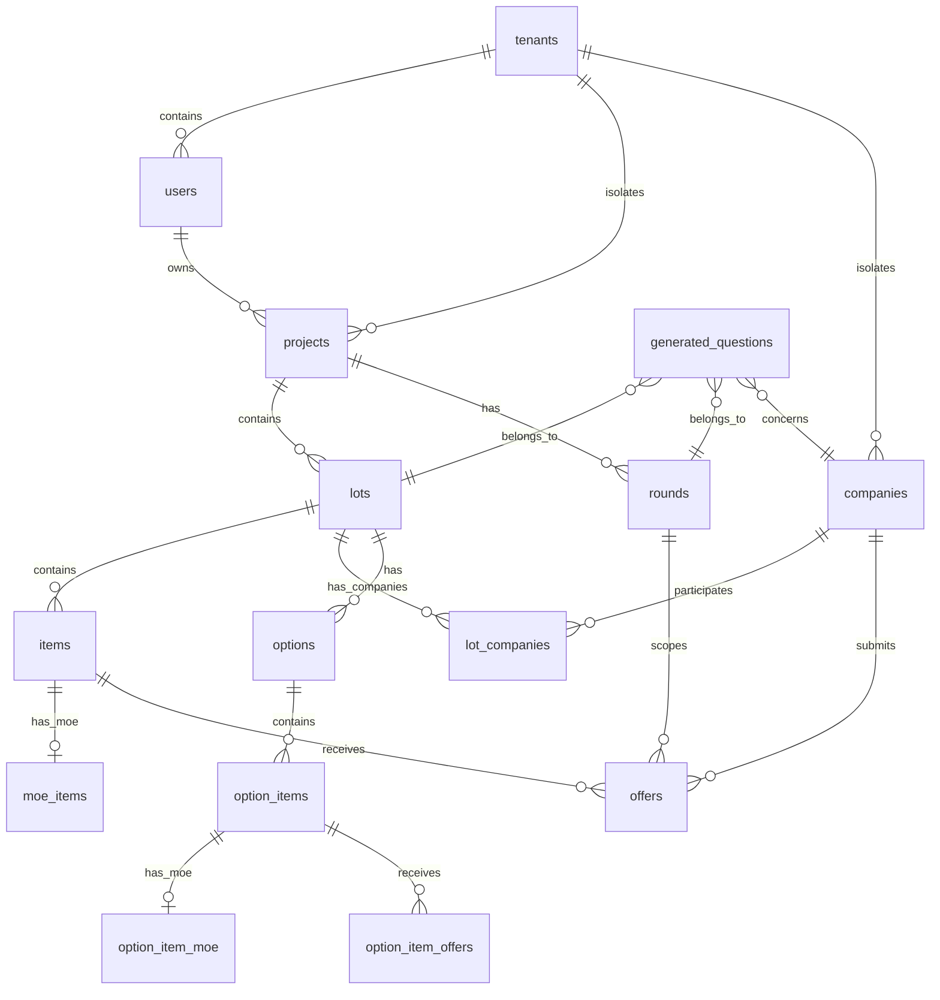

# Schéma de données PostgreSQL

Documentation consolidée depuis `server/src/app/schema.sql` et les migrations
`server/src/app/migrations/*.sql`.

Les listes de colonnes ci-dessous décrivent les champs métier principaux. Toute
table appartenant à un tenant porte également un `tenant_id NOT NULL`, protégé
par RLS et, lorsque nécessaire, par des clés étrangères composites.

## Vue d'ensemble

L'application gere des affaires d'appel d'offres autour de cette hierarchie principale :

Logique métier importante :

- Les `projects` représentent les affaires.
- Les `lots` appartiennent à un projet.
- Les `items` sont les lignes DPGF d'un lot. Depuis la migration 006, ils sont partages entre les tours.
- Les `moe_items` portent l'estimation MOE par ligne DPGF. Ils sont aussi partages entre les tours.
- Les `rounds` représentent les phases ou tours de consultation d'un projet.
- Les `offers` sont les réponses des entreprises. Elles sont spécifiques à un `round_id`.
- Les `companies` sont associees aux lots via `lot_companies`.
- Les `generated_questions` stockent les fiches questions generees ou manuelles, par lot, tour, entreprise et ligne ou option.
- Les `options` représentent des mini-lots optionnels, avec leurs propres lignes, MOE et offres.

## Cloisonnement tenant

La migration 045 ajoute `tenant_id` aux tables métier, des clés étrangères
composites et des politiques PostgreSQL `FORCE ROW LEVEL SECURITY`. La
migration 046 réserve le scope de migration au propriétaire du schéma.
`companies` reste la table des entreprises répondantes et ne représente pas une
organisation cliente. Les deux tenants initiaux sont `dmx` et `demo`.

## Cycle d'initialisation

Avant le demarrage, `npm run db:migrate` :

1. exécute `server/src/app/schema.sql` ;
2. crée la table technique `migrations` si besoin ;
3. execute les migrations SQL triees par nom ;
4. enregistre chaque migration terminee.

Au demarrage web, `ensureSchema()` ne fait que verifier le schema et le role
PostgreSQL runtime.

La table `migrations` contient :

| Colonne | Type | Rôle |
| --- | --- | --- |
| `id` | `SERIAL PRIMARY KEY` | Identifiant technique |
| `name` | `TEXT UNIQUE NOT NULL` | Nom du fichier de migration execute |
| `executed_at` | `TIMESTAMPTZ DEFAULT now()` | Date d'execution |

## Domaine utilisateurs et accès

### `tenants`

Organisations clientes et environnement de démonstration.

| Colonne | Type | Rôle |
| --- | --- | --- |
| `id` | `BIGSERIAL PRIMARY KEY` | Identifiant du tenant |
| `slug` | `TEXT UNIQUE NOT NULL` | Clé stable (`dmx`, `demo`) |
| `name` | `TEXT NOT NULL` | Nom affiché |
| `type` | `TEXT NOT NULL` | `customer` ou `demo` |
| `status` | `TEXT NOT NULL` | `active` ou `suspended` |
| `created_at` | `TIMESTAMPTZ NOT NULL` | Date de création |

### `users`

Comptes applicatifs.

| Colonne | Type | Rôle |
| --- | --- | --- |
| `id` | `BIGSERIAL PRIMARY KEY` | Identifiant utilisateur |
| `email` | `TEXT NOT NULL` | Email de connexion |
| `password_hash` | `TEXT NOT NULL` | Mot de passe hashe |
| `role` | `TEXT NOT NULL DEFAULT 'visionneur'` | `platform_admin`, `tenant_admin`, `responsable`, `visionneur`, `entreprise` |
| `tenant_id` | `BIGINT REFERENCES tenants(id)` | Organisation d'appartenance du compte |
| `company_id` | `INTEGER REFERENCES companies(id) ON DELETE SET NULL` | Entreprise rattachée, utile pour les comptes entreprise |
| `email_verified` | `BOOLEAN DEFAULT FALSE` | Statut de vérification email |
| `created_at` | `TIMESTAMPTZ DEFAULT now()` | Date de creation |

Index :

- `users_email_lower_idx` : unicite fonctionnelle sur `lower(email)`.
- `idx_users_company_id` : recherche par entreprise.

### `project_shares`

Partages d'affaires avec des utilisateurs.

| Colonne | Type | Rôle |
| --- | --- | --- |
| `id` | `BIGSERIAL PRIMARY KEY` | Identifiant du partage |
| `project_id` | `BIGINT REFERENCES projects(id) ON DELETE CASCADE` | Projet partage |
| `shared_with_user_id` | `BIGINT REFERENCES users(id) ON DELETE CASCADE` | Utilisateur beneficiaire |
| `can_view` | `BOOLEAN DEFAULT true` | Droit de lecture |
| `can_edit` | `BOOLEAN DEFAULT false` | Droit d'ecriture |
| `shared_by_user_id` | `BIGINT REFERENCES users(id) ON DELETE SET NULL` | Auteur du partage |
| `created_at` | `TIMESTAMPTZ DEFAULT now()` | Date de creation |

Contrainte : un seul partage par couple `(project_id, shared_with_user_id)`.

### `access_requests`

Demandes d'accès faites par les utilisateurs.

| Colonne | Type | Rôle |
| --- | --- | --- |
| `id` | `SERIAL PRIMARY KEY` | Identifiant |
| `user_id` | `INTEGER REFERENCES users(id) ON DELETE CASCADE` | Demandeur |
| `project_id` | `INTEGER REFERENCES projects(id) ON DELETE CASCADE`, nullable | Projet cible si connu |
| `project_name` | `TEXT`, nullable | Nom libre du projet demande |
| `message` | `TEXT` | Message du demandeur |
| `status` | `TEXT DEFAULT 'pending'` | `pending`, `approved`, `rejected` |
| `reviewed_by` | `INTEGER REFERENCES users(id) ON DELETE SET NULL` | Validateur |
| `reviewed_at` | `TIMESTAMPTZ` | Date de validation ou refus |
| `created_at` | `TIMESTAMPTZ DEFAULT now()` | Date de demande |

Index uniques partiels :

- une demande `pending` par utilisateur et `project_name` ;
- une demande `pending` par utilisateur et `project_id`.

## Domaine projet, lots et DPGF

### `projects`

Affaires ou projets.

| Colonne | Type | Rôle |
| --- | --- | --- |
| `id` | `BIGSERIAL PRIMARY KEY` | Identifiant projet |
| `name` | `TEXT NOT NULL` | Nom de l'affaire |
| `référence` | `TEXT` | référence interne |
| `client` | `TEXT` | Client |
| `location` | `TEXT` | Localisation |
| `study_phase` | `TEXT` | Phase d'etude |
| `study_date` | `DATE` | Date d'etude |
| `created_by` | `BIGINT` | Ancien createur, sans cle etrangere depuis migration 002 |
| `owner_id` | `BIGINT REFERENCES users(id) ON DELETE SET NULL` | Proprietaire applicatif |
| `created_at` | `TIMESTAMPTZ DEFAULT now()` | Date de creation |

### `lots`

Lots techniques d'une affaire.

| Colonne | Type | Rôle |
| --- | --- | --- |
| `id` | `BIGSERIAL PRIMARY KEY` | Identifiant lot |
| `project_id` | `BIGINT REFERENCES projects(id) ON DELETE CASCADE` | Projet parent |
| `code` | `TEXT` | Code du lot |
| `macro_lot` | `TEXT` | Regroupement superieur |
| `name` | `TEXT NOT NULL` | Nom du lot |
| `sort_order` | `INTEGER DEFAULT 0` | Ordre d'affichage |
| `created_at` | `TIMESTAMPTZ DEFAULT now()` | Date de creation |

Index :

- `idx_lots_project_id`
- `idx_lots_sort_order` sur `(project_id, sort_order)`
- `idx_lots_project_macro_lot` sur `(project_id, macro_lot)`

### `companies`

Entreprises consultantes ou repondantes.

| Colonne | Type | Rôle |
| --- | --- | --- |
| `id` | `BIGSERIAL PRIMARY KEY` | Identifiant entreprise |
| `name` | `TEXT NOT NULL` | Nom |
| `color` | `TEXT` | Couleur d'affichage |
| `email` | `TEXT` | Email destinataire des fiches questions |
| `created_at` | `TIMESTAMPTZ DEFAULT now()` | Date de creation |

### `lot_companies`

Association plusieurs-a-plusieurs entre lots et entreprises.

| Colonne | Type | Rôle |
| --- | --- | --- |
| `lot_id` | `BIGINT REFERENCES lots(id) ON DELETE CASCADE` | Lot |
| `company_id` | `BIGINT REFERENCES companies(id) ON DELETE CASCADE` | Entreprise |
| `created_at` | `TIMESTAMPTZ DEFAULT now()` | Date d'association, aussi utilisée pour l'ordre d'affichage |

Cle primaire : `(lot_id, company_id)`.

### `items`

Lignes DPGF d'un lot.

| Colonne | Type | Rôle |
| --- | --- | --- |
| `id` | `BIGSERIAL PRIMARY KEY` | Identifiant ligne |
| `lot_id` | `BIGINT REFERENCES lots(id) ON DELETE CASCADE` | Lot parent |
| `num` | `TEXT` | Numero de poste |
| `Désignation` | `TEXT` | Désignation. Nullable depuis migration 003 |
| `unit` | `TEXT` | Unité MOE |
| `position` | `INTEGER` | Ordre dans le tableau importe |
| `source_company_id` | `BIGINT REFERENCES companies(id) ON DELETE SET NULL` | Entreprise source si poste ajoute par une entreprise |
| `created_at` | `TIMESTAMPTZ DEFAULT now()` | Date de creation |

### `moe_items`

Estimation MOE pour une ligne DPGF.

| Colonne | Type | Rôle |
| --- | --- | --- |
| `item_id` | `BIGINT PRIMARY KEY REFERENCES items(id) ON DELETE CASCADE` | Ligne DPGF |
| `qty` | `NUMERIC` | Quantité MOE |
| `unit_price` | `NUMERIC` | Prix unitaire MOE |
| `amount` | `NUMERIC` | Montant MOE |
| `comment` | `TEXT` | Commentaire MOE |

Relation : un `item` a zero ou un `moe_items`.

### `offers`

Offres des entreprises pour les lignes DPGF. Contrairement aux items et MOE, les offres sont liées à un tour.

| Colonne | Type | Rôle |
| --- | --- | --- |
| `id` | `BIGSERIAL PRIMARY KEY` | Identifiant offre |
| `item_id` | `BIGINT REFERENCES items(id) ON DELETE CASCADE` | Ligne DPGF |
| `company_id` | `BIGINT REFERENCES companies(id) ON DELETE CASCADE` | Entreprise |
| `round_id` | `INTEGER REFERENCES rounds(id) ON DELETE CASCADE` | Tour de consultation |
| `unit` | `TEXT` | Unité repondue |
| `qty` | `NUMERIC` | Quantité repondue |
| `unit_price` | `NUMERIC` | Prix unitaire repondu |
| `amount` | `NUMERIC` | Montant repondu |
| `comment` | `TEXT` | Commentaire importe ou saisi |
| `offer_designation` | `TEXT` | Désignation entreprise si differente de la DPGF |

Contrainte finale : unicite `(item_id, company_id, round_id)`.

## Domaine tours et options

### `rounds`

Tours ou phases d'un projet.

| Colonne | Type | Rôle |
| --- | --- | --- |
| `id` | `SERIAL PRIMARY KEY` | Identifiant tour |
| `project_id` | `INTEGER REFERENCES projects(id) ON DELETE CASCADE` | Projet parent |
| `round_number` | `INTEGER NOT NULL` | Ordre logique : 0 = ouverture |
| `name` | `VARCHAR(255) NOT NULL` | Nom du tour |
| `description` | `TEXT` | Description |
| `status` | `VARCHAR(50) DEFAULT 'active'` | `active`, `closed`, `archived` |
| `created_at` | `TIMESTAMPTZ DEFAULT now()` | Date de creation |

Contrainte : un seul tour par `(project_id, round_number)`.

### `round_lots`

Association entre tours et lots.

| Colonne | Type | Rôle |
| --- | --- | --- |
| `id` | `SERIAL PRIMARY KEY` | Identifiant |
| `round_id` | `INTEGER REFERENCES rounds(id) ON DELETE CASCADE` | Tour |
| `lot_id` | `INTEGER REFERENCES lots(id) ON DELETE CASCADE` | Lot |
| `created_at` | `TIMESTAMPTZ DEFAULT now()` | Date d'association |

Contrainte : unicite `(round_id, lot_id)`.

### `options`

Mini-lots optionnels rattachés à un lot et à un tour.

| Colonne | Type | Rôle |
| --- | --- | --- |
| `id` | `SERIAL PRIMARY KEY` | Identifiant option |
| `lot_id` | `INT REFERENCES lots(id) ON DELETE CASCADE` | Lot parent |
| `round_id` | `INT REFERENCES rounds(id) ON DELETE CASCADE` | Tour parent |
| `Désignation` | `VARCHAR(255) NOT NULL` | Nom de l'option |
| `created_at` | `TIMESTAMP DEFAULT now()` | Date de creation |

Contrainte : unicite `(lot_id, round_id, Désignation)`.

### `option_items`

Lignes d'une option.

| Colonne | Type | Rôle |
| --- | --- | --- |
| `id` | `SERIAL PRIMARY KEY` | Identifiant ligne d'option |
| `option_id` | `INT REFERENCES options(id) ON DELETE CASCADE` | Option parent |
| `num` | `VARCHAR(50)` | Numero |
| `Désignation` | `VARCHAR(255)` | Désignation |
| `unit` | `VARCHAR(50)` | Unité |
| `created_at` | `TIMESTAMP DEFAULT now()` | Date de creation |

### `option_item_moe`

MOE d'une ligne d'option.

| Colonne | Type | Rôle |
| --- | --- | --- |
| `id` | `SERIAL PRIMARY KEY` | Identifiant |
| `option_item_id` | `INT REFERENCES option_items(id) ON DELETE CASCADE` | Ligne d'option |
| `qty` | `DECIMAL(15,4)` | Quantité MOE |
| `unit_price` | `DECIMAL(15,4)` | Prix unitaire MOE |

Contrainte : unicite `option_item_id`.

### `option_item_offers`

Offres entreprises sur les lignes d'option.

| Colonne | Type | Rôle |
| --- | --- | --- |
| `id` | `SERIAL PRIMARY KEY` | Identifiant offre d'option |
| `option_item_id` | `INT REFERENCES option_items(id) ON DELETE CASCADE` | Ligne d'option |
| `company_id` | `INT REFERENCES companies(id) ON DELETE CASCADE` | Entreprise |
| `round_id` | `INT REFERENCES rounds(id) ON DELETE CASCADE` | Tour |
| `qty` | `DECIMAL(15,4)` | Quantité repondue |
| `unit_price` | `DECIMAL(15,4)` | Prix unitaire repondu |

Contrainte : unicite `(option_item_id, company_id, round_id)`.

## Domaine fiches questions

### `project_question_config`

Configuration des textes de questions au niveau projet.

| Colonne | Type | Rôle |
| --- | --- | --- |
| `project_id` | `BIGINT PRIMARY KEY REFERENCES projects(id) ON DELETE CASCADE` | Projet configuré |
| `question_qty_*` | `TEXT` | Textes pour ecarts de Quantité |
| `question_price_*` | `TEXT` | Textes pour ecarts de prix unitaire |
| `question_amount_*` | `TEXT` | Textes pour ecarts de montant |
| `question_unit_mismatch` | `TEXT` | Texte pour incoherence d'Unité |
| `unanswered_comment` | `TEXT` | Commentaire automatique pour article sans Réponse |
| `unanswered_color` | `TEXT` | Couleur d'affichage pour article sans Réponse |
| `offer_amount_mismatch_comment` | `TEXT` | Commentaire automatique si montant importe incoherent |
| `updated_at` | `TIMESTAMPTZ DEFAULT now()` | Date de mise a jour |

Les suffixes utilises sont notamment `very_low`, `low`, `high`, `very_high`.

### `lot_threshold_config`

Configuration des seuils de declenchement au niveau lot.

| Colonne | Type | Rôle |
| --- | --- | --- |
| `lot_id` | `BIGINT PRIMARY KEY REFERENCES lots(id) ON DELETE CASCADE` | Lot configuré |
| `qty_*_threshold` | `NUMERIC` | Seuils Quantité |
| `price_*_threshold` | `NUMERIC` | Seuils prix unitaire |
| `amount_*_threshold` | `NUMERIC` | Seuils montant |
| `updated_at` | `TIMESTAMPTZ DEFAULT now()` | Date de mise a jour |

### `generated_questions`

Questions generees automatiquement ou creees manuellement.

| Colonne | Type | Rôle |
| --- | --- | --- |
| `id` | `BIGSERIAL PRIMARY KEY` | Identifiant question |
| `lot_id` | `BIGINT REFERENCES lots(id) ON DELETE CASCADE` | Lot concerne |
| `round_id` | `INTEGER REFERENCES rounds(id) ON DELETE CASCADE` | Tour concerne |
| `item_id` | `BIGINT REFERENCES items(id) ON DELETE CASCADE`, nullable | Ligne DPGF concernee |
| `option_item_id` | `BIGINT REFERENCES option_items(id) ON DELETE CASCADE`, nullable | Ligne d'option concernee |
| `company_id` | `BIGINT REFERENCES companies(id) ON DELETE CASCADE` | Entreprise concernee |
| `question_type` | `TEXT NOT NULL` | Type de question |
| `question_text` | `TEXT NOT NULL` | Texte final |
| `moe_value` | `NUMERIC` | Valeur MOE comparee |
| `offer_value` | `NUMERIC` | Valeur entreprise comparee |
| `deviation_pct` | `NUMERIC` | Ecart en pourcentage |
| `status` | `TEXT DEFAULT 'pending'` | `pending`, `answered`, `dismissed` |
| `comment` | `TEXT` | Commentaire / Réponse interne |
| `answered_at` | `TIMESTAMPTZ` | Date de Réponse |
| `created_at` | `TIMESTAMPTZ DEFAULT now()` | Date de creation |

Types valides finaux :

- `qty_very_low`, `qty_low`, `qty_high`, `qty_very_high`
- `price_very_low`, `price_low`, `price_high`, `price_very_high`
- `amount_very_low`, `amount_low`, `amount_high`, `amount_very_high`
- `unit_mismatch`
- `manual`

Contraintes :

- une question cible soit un `item_id`, soit un `option_item_id`, mais jamais les deux ;
- unicite partielle par `(round_id, lot_id, item_id, company_id, question_type)` quand `item_id` est renseigne ;
- unicite partielle par `(round_id, lot_id, option_item_id, company_id, question_type)` quand `option_item_id` est renseigne.

### `question_sheets`

Ancien système RAO de fiches questions liées directement aux items. La migration 005 supprime cette table si elle provenait de l'ancien modèle `rounds` par lot, puis le code actuel continue à l'utiliser dans `routes/questions/index.js`.

| Colonne | Type | Rôle |
| --- | --- | --- |
| `id` | `BIGSERIAL PRIMARY KEY` | Identifiant |
| `round_id` | `BIGINT REFERENCES rounds(id) ON DELETE CASCADE` | Tour |
| `item_id` | `BIGINT REFERENCES items(id) ON DELETE CASCADE` | Ligne DPGF |
| `company_id` | `BIGINT REFERENCES companies(id) ON DELETE CASCADE` | Entreprise |
| `question_type` | `TEXT NOT NULL` | Type de question |
| `question` | `TEXT NOT NULL` | Texte |
| `moe_qty` | `NUMERIC` | Quantité MOE au moment de la génération |
| `company_qty` | `NUMERIC` | Quantité entreprise |
| `difference_percent` | `NUMERIC` | Ecart |
| `response` | `TEXT` | Réponse entreprise |
| `response_date` | `DATE` | Date de Réponse |
| `status` | `TEXT DEFAULT 'pending'` | Statut |
| `created_at` | `TIMESTAMPTZ DEFAULT now()` | Creation |
| `updated_at` | `TIMESTAMPTZ DEFAULT now()` | Mise a jour |

### `question_sheet_sends`

Historique des envois de fiches questions par email.

| Colonne | Type | Rôle |
| --- | --- | --- |
| `id` | `BIGSERIAL PRIMARY KEY` | Identifiant envoi |
| `lot_id` | `BIGINT REFERENCES lots(id) ON DELETE CASCADE` | Lot |
| `round_id` | `BIGINT REFERENCES rounds(id) ON DELETE CASCADE` | Tour |
| `company_id` | `BIGINT REFERENCES companies(id) ON DELETE CASCADE` | Entreprise |
| `sent_at` | `TIMESTAMPTZ DEFAULT now()` | Date d'envoi |
| `sent_by` | `BIGINT REFERENCES users(id) ON DELETE SET NULL` | Utilisateur emetteur |
| `sent_to_email` | `TEXT NOT NULL` | Adresse destinataire |
| `email_subject` | `TEXT` | Sujet email |

Contrainte : unicite `(lot_id, round_id, company_id, sent_at)`.

## Domaine Sécurité

### `email_verifications`

Tokens de vérification d'email.

| Colonne | Type | Rôle |
| --- | --- | --- |
| `id` | `SERIAL PRIMARY KEY` | Identifiant |
| `user_id` | `INTEGER REFERENCES users(id) ON DELETE CASCADE` | Utilisateur |
| `token` | `TEXT UNIQUE NOT NULL` | Token |
| `expires_at` | `TIMESTAMPTZ NOT NULL` | Expiration |
| `verified_at` | `TIMESTAMPTZ` | Date de validation |
| `created_at` | `TIMESTAMPTZ DEFAULT now()` | Creation |

### `password_resets`

Tokens de reinitialisation de mot de passe.

| Colonne | Type | Rôle |
| --- | --- | --- |
| `id` | `BIGSERIAL PRIMARY KEY` | Identifiant |
| `user_id` | `BIGINT REFERENCES users(id) ON DELETE CASCADE` | Utilisateur |
| `token` | `TEXT UNIQUE NOT NULL` | Token |
| `expires_at` | `TIMESTAMPTZ NOT NULL` | Expiration |
| `used_at` | `TIMESTAMPTZ` | Date d'utilisation |
| `created_at` | `TIMESTAMPTZ DEFAULT now()` | Creation |

### `refresh_tokens`

Refresh tokens avec rotation.

| Colonne | Type | Rôle |
| --- | --- | --- |
| `id` | `SERIAL PRIMARY KEY` | Identifiant |
| `user_id` | `BIGINT REFERENCES users(id) ON DELETE CASCADE` | Utilisateur |
| `token` | `VARCHAR(255) UNIQUE NOT NULL` | Token |
| `family` | `VARCHAR(255)` | Famille de rotation |
| `expires_at` | `TIMESTAMPTZ NOT NULL` | Expiration |
| `revoked_at` | `TIMESTAMPTZ` | révocation |
| `created_at` | `TIMESTAMPTZ DEFAULT now()` | Creation |
| `rotation_count` | `INT DEFAULT 0` | Nombre de rotations |

### `suspicious_token_attempts`

Journal des reutilisations suspectes de refresh tokens.

| Colonne | Type | Rôle |
| --- | --- | --- |
| `id` | `SERIAL PRIMARY KEY` | Identifiant |
| `user_id` | `BIGINT REFERENCES users(id) ON DELETE CASCADE` | Utilisateur |
| `token_family` | `VARCHAR(255)` | Famille concernee |
| `ip_address` | `VARCHAR(45)` | Adresse IP |
| `user_agent` | `TEXT` | User agent |
| `attempted_at` | `TIMESTAMPTZ DEFAULT now()` | Date de detection |

### `honeypot_attempts`

Journal anti-bot des champs pieges remplis.

| Colonne | Type | Rôle |
| --- | --- | --- |
| `id` | `SERIAL PRIMARY KEY` | Identifiant |
| `ip_address` | `VARCHAR(45)` | Adresse IP |
| `user_agent` | `TEXT` | User agent |
| `endpoint` | `VARCHAR(100)` | Endpoint cible |
| `filled_fields` | `JSONB` | Champs honeypot remplis |
| `detected_at` | `TIMESTAMPTZ DEFAULT now()` | Date de detection |

## Tables historiques ou de compatibilité

### `moe`

Table legacy conservée pour compatibilité. Le modèle actif utilisé `moe_items`.

| Colonne | Type | Rôle |
| --- | --- | --- |
| `id` | `BIGSERIAL PRIMARY KEY` | Identifiant |
| `item_id` | `BIGINT UNIQUE REFERENCES items(id) ON DELETE CASCADE` | Ligne DPGF |
| `qty` | `NUMERIC` | Quantité |
| `unit_price` | `NUMERIC` | Prix unitaire |

### `round_offers`

Table historique issue du premier système RAO. Elle est supprimée lors de la migration 005 si l'ancien modèle de `rounds` par lot est détecté. Le modèle courant utilisé `offers.round_id`.

## Points d'attention

- Plusieurs migrations ont corrigé des modèles précédents. Pour comprendre
  l’état final, il faut lire `schema.sql` et toutes les migrations exécutées.
- Les unicités métier des entreprises sont limitées au tenant, notamment
  `(tenant_id, name)` et `(tenant_id, lower(name))`.
- Les `items` et `moe_items` ne dependent plus des tours ; les `offers` et `generated_questions` en dependent.
- `generated_questions` peut cibler soit une ligne DPGF (`item_id`), soit une ligne d'option (`option_item_id`).
