# Formation AO Link

Document Généré le 26/05/2026.

Source des captures : https://démo.ao-link.fr

## Objectif de la formation

Ce support accompagne la prise en main d'AO Link sur l'environnement de démonstration démo.ao-link.fr.

Il documenté les principaux parcours utilisateur visibles dans la version démo : connexion, gestion des projets, tours, lots, comparaison des offres, questions automatiques, configuration et administration.

## Connexion et Accès à la démo

Depuis la page de connexion, le compte démo est pre-rempli lorsque le mode beta/démo est active.

L'utilisateur clique sur Se connecter pour acceder à l'espace de travail. Les champs techniques honeypot ne doivent jamais être remplis ni ajoutés dans une automatisation.

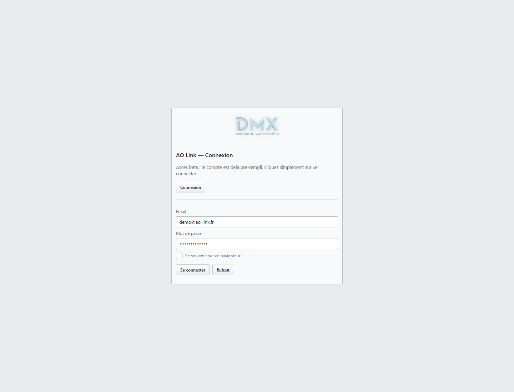

Etapes :
- Ouvrir démo.ao-link.fr/login.
- Vérifier que l'email et le mot de passe démo sont présents.
- Cliquer sur Se connecter.

## Tableau de bord et liste des projets

La page Projets est le point de depart du travail. Elle permet de créer un projet, d'ouvrir un dossier existant et d'acceder aux actions d'Édition ou de partage.

Dans la démo, un projet de référence est disponible afin de parcourir les écrans sans recreer de données.

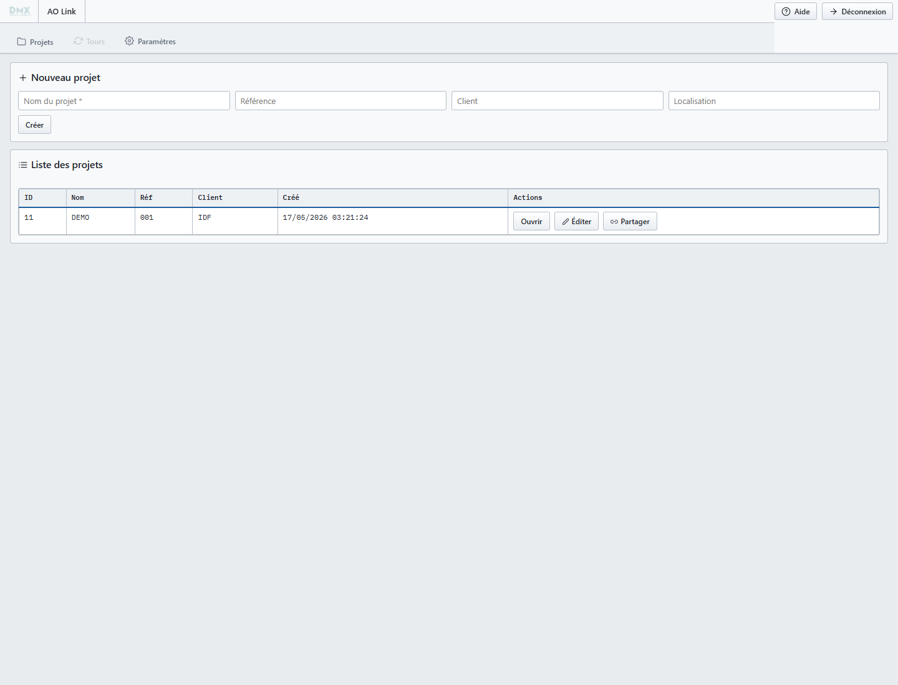

Etapes :
- Consulter la liste des projets.
- Utiliser Ouvrir pour entrer dans le projet.
- Utiliser Editer ou Partager si le Rôle le permet.

## Édition d'un projet

La fenetre d'Édition sert a corriger les informations principales du projet : nom, référence, client, date d'etude et partages associes.

Elle est utile en debut de dossier ou lorsqu'un projet change de perimetre.

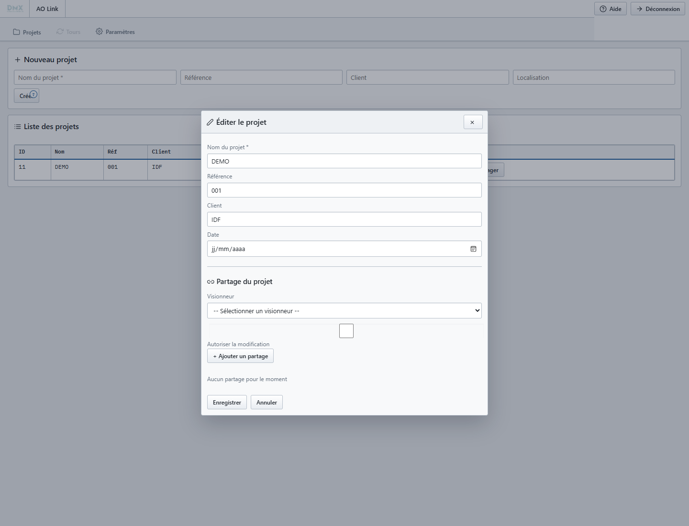

Etapes :
- Cliquer sur Editer depuis la ligne du projet.
- Modifier les champs necessaires.
- Enregistrer les changements, ou fermer sans action si la modification n'est pas souhaitee.

## Partage d'un projet

Le partage donne Accès à un projet à des utilisateurs visionneurs. Une option permet d'autoriser la modification lorsque le contexte le justifie.

Ce parcours est important pour distinguer la consultation simple de la collaboration active.

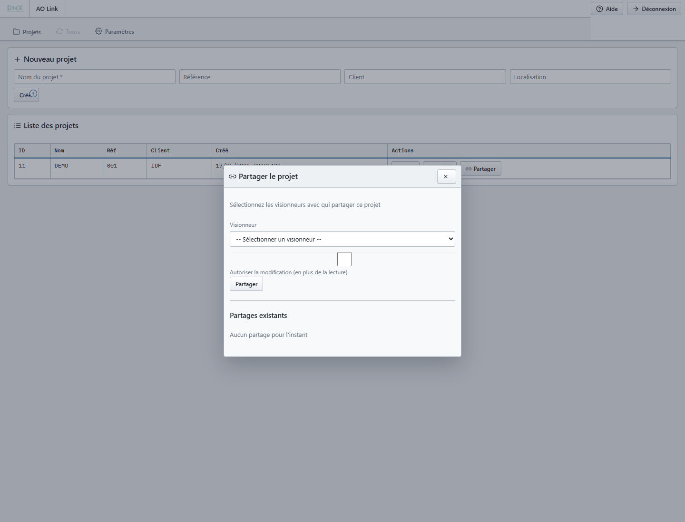

Etapes :
- Cliquer sur Partager.
- Sélectionner un visionneur.
- Choisir lecture seule ou lecture avec modification.
- Valider le partage puis Vérifier la liste des partages existants.

## Gestion des tours

Un tour correspond à une phase de consultation : ouverture, negociation, second tour ou ajustement.

Chaque tour porte ses propres lots, offres, questions et statistiques afin de suivre l'evolution de l'appel d'offres dans le temps.

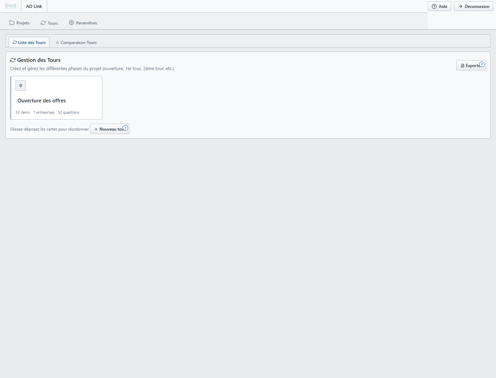

Etapes :
- Ouvrir un projet.
- Consulter les cartes de tours.
- Sélectionner un tour pour voir ses lots.
- Utiliser Nouveau tour ou Exporter selon le besoin et les droits.

## Comparaison des tours

La comparaison des tours donne une vue de synthèse sur l'evolution des montants et des choix entre phases.

Les sous-vues Comparatif, Sélection options et Simulation servent respectivement à analyser les montants, les options et les scénarios de décision.

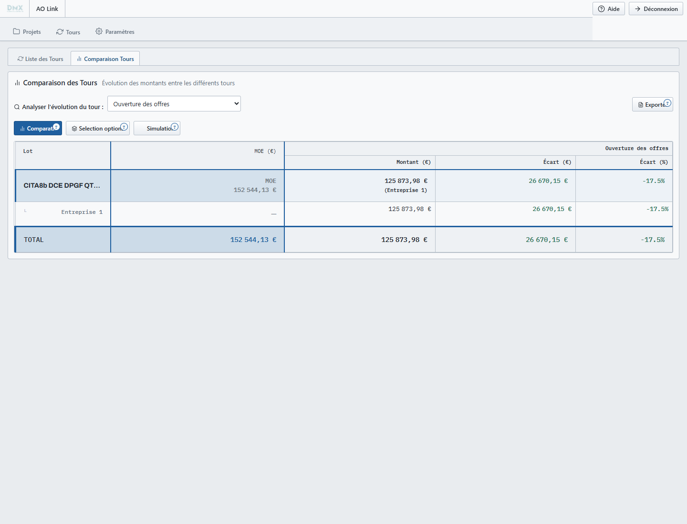

Etapes :
- Depuis l'onglet Tours, ouvrir Comparaison Tours.
- Sélectionner le tour à analyser si nécessaire.
- Parcourir les vues Comparatif, Sélection options et Simulation.

## Lots d'un tour

La vue Lots liste les lots rattachés au tour selectionne. C'est le passage vers le détail des données d'un lot.

Selon le Rôle, l'utilisateur peut ouvrir, modifier, importer ou reordonner les lots.

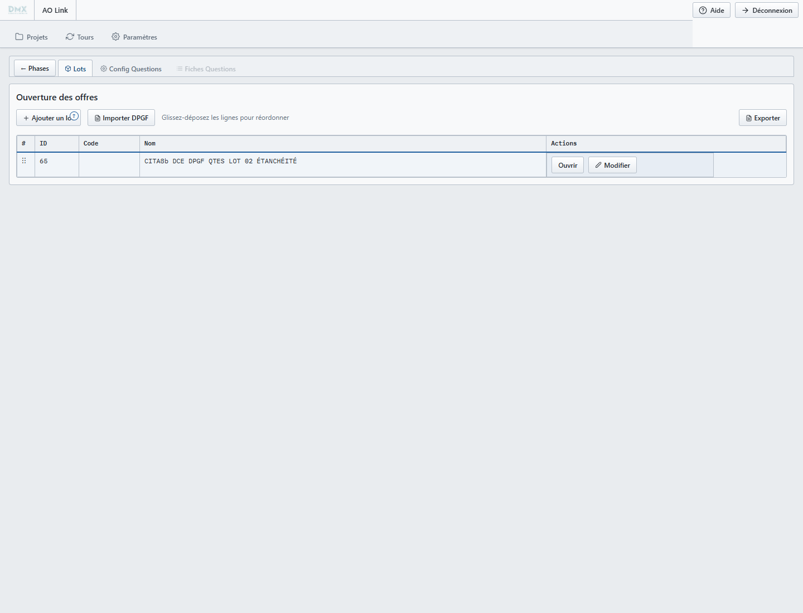

Etapes :
- Sélectionner un tour.
- Vérifier la liste des lots.
- Cliquer sur Ouvrir pour acceder au tableau comparatif du lot.

## Configuration globale des questions

La configuration des questions definit les seuils et les regles qui declenchent les alertes automatiques.

Elle permet d'adapter AO Link au niveau de sensibilite attendu sur les quantités, prix unitaires, montants ou réponses manquantes.

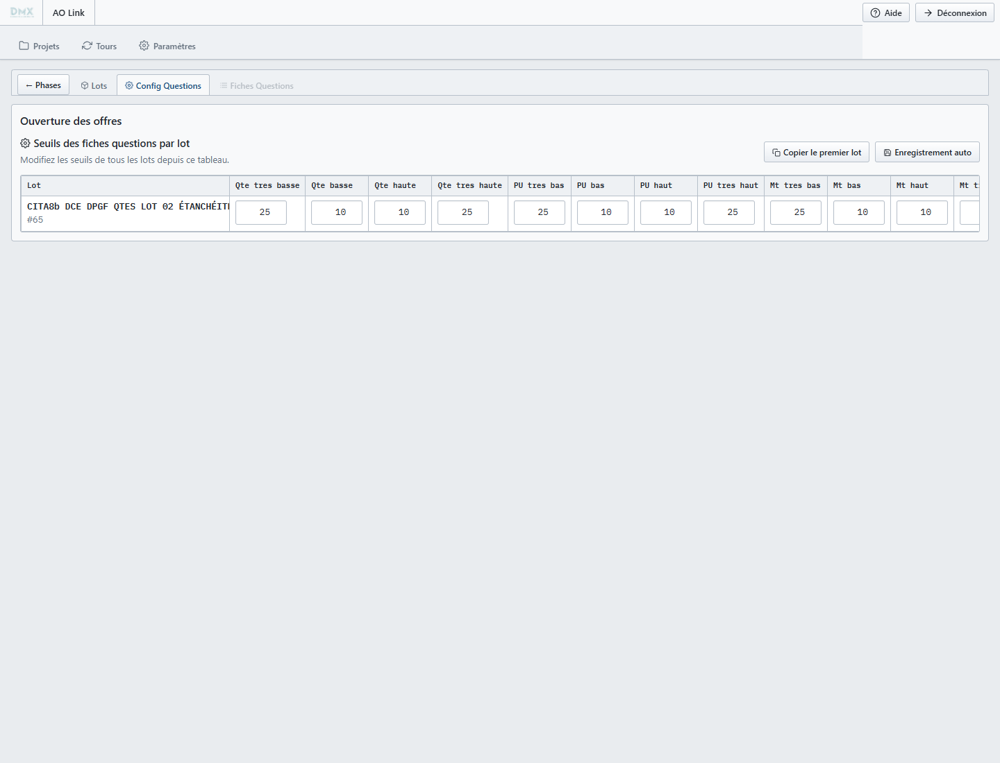

Etapes :
- Ouvrir Config Questions depuis un tour.
- Vérifier les seuils actifs.
- Ajuster les valeurs lorsque la strategie d'analyse le demande.

## Comparatif d'un lot

Le comparatif d'un lot rassemble les lignes MOE et les offres entreprises pour faciliter l'analyse.

Les differences, cellules vides et montants atypiques deviennent visibles dans une vue unique.

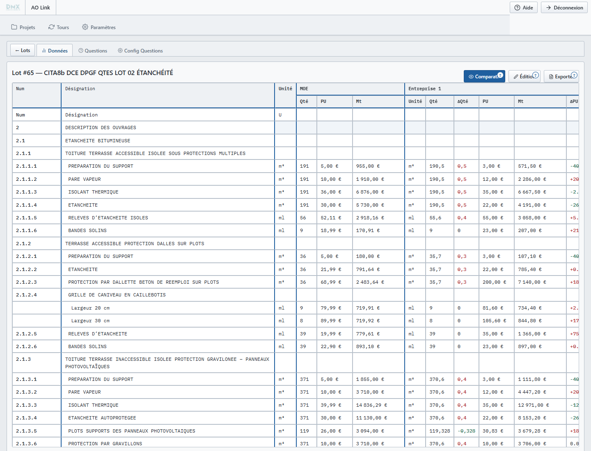

Etapes :
- Ouvrir un lot depuis la liste des lots.
- Rester en mode Comparatif pour lire les offres.
- Utiliser les totaux, couleurs et indicateurs pour identifier les points a controler.

## Mode Édition des données

Le mode Édition expose une logique proche d'un tableur. Il sert a corriger les lignes, quantités et offres quand l'utilisateur dispose des droits d'ecriture.

La saisie doit rester prudente : les modifications alimentent ensuite les comparatifs et les questions.

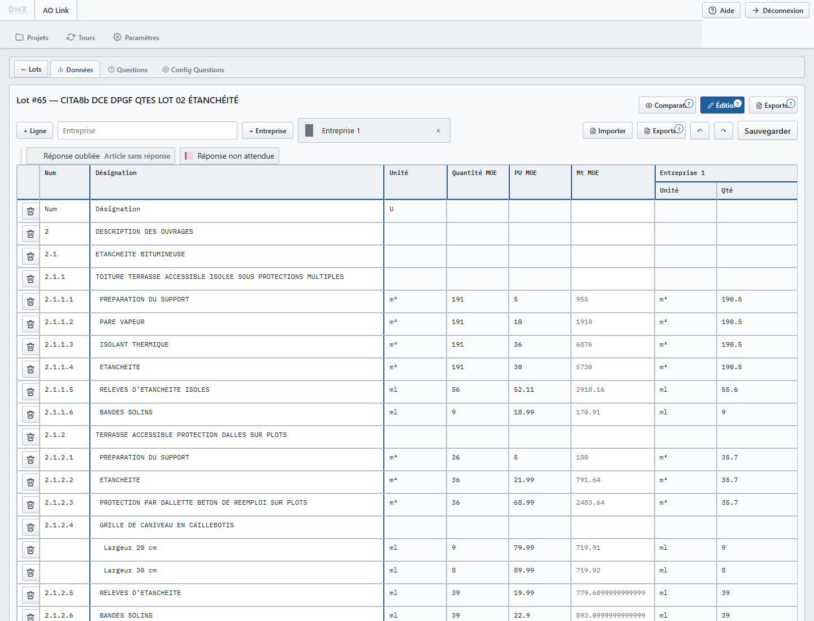

Etapes :
- Cliquer sur Édition dans le lot.
- Modifier les cellules utiles.
- Controler le resultat en revenant au mode Comparatif.

## Questions du lot

L'onglet Questions regroupe les points de vigilance générés automatiquement ou prepares pour echange avec les entreprises.

Les filtres permettent de cibler les quantités, prix unitaires, montants, entreprises ou ecarts MOE/entreprise.

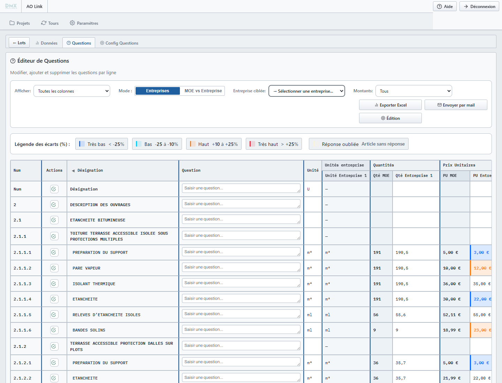

Etapes :
- Ouvrir l'onglet Questions du lot.
- Filtrer les questions selon le type d'ecart recherche.
- Exporter ou preparer l'envoi lorsque la revue est prete.

## Configuration des questions du lot

Cette configuration affine les seuils au niveau du lot. Elle complète la configuration globale lorsqu'un lot demande une sensibilite particuliere.

Elle sert notamment a gerer les ecarts tres bas, bas, hauts, tres hauts et les réponses oubliees.

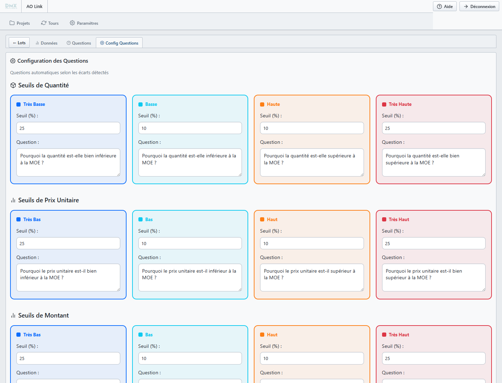

Etapes :
- Ouvrir Config Questions dans le lot.
- Vérifier les seuils par type de donnee.
- Modifier uniquement les valeurs utiles au contexte du lot.

## Paramètres et administration

L'onglet Paramètres regroupe les fonctions d'administration accessibles selon le Rôle.

Il couvre notamment les utilisateurs, les rôles, les entreprises rattachees et la validation des comptes.

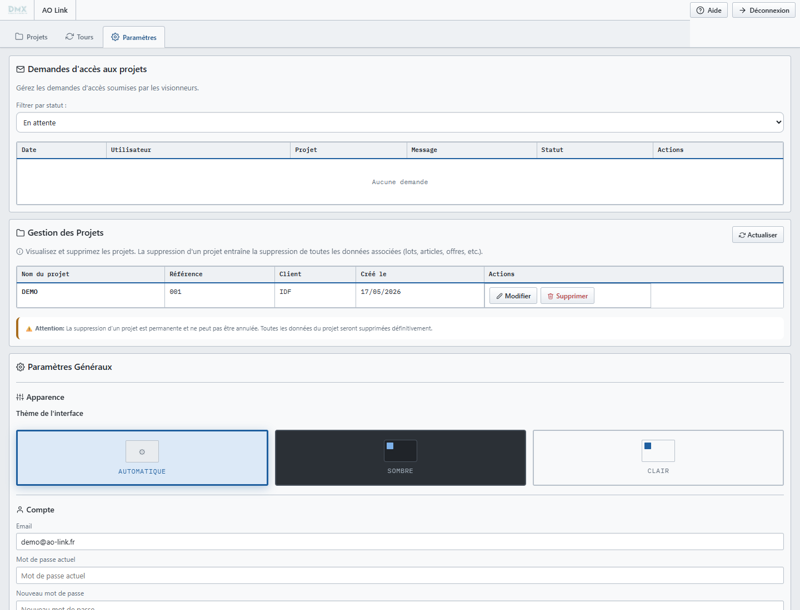

Etapes :
- Ouvrir Paramètres.
- Vérifier les utilisateurs et leurs rôles.
- Mettre à jour les droits uniquement lorsque la responsabilité du dossier le nécessite.

## synthèse des parcours couverts

Les captures couvrent les parcours principaux de la démo : Accès, projet, partage, tours, comparaison, lots, Données, questions et administration.

La fiche Questions au niveau tour était désactivée dans l'état observé avant sélection d'un lot; le parcours fonctionnel des questions est donc documenté via l'onglet Questions du lot.
